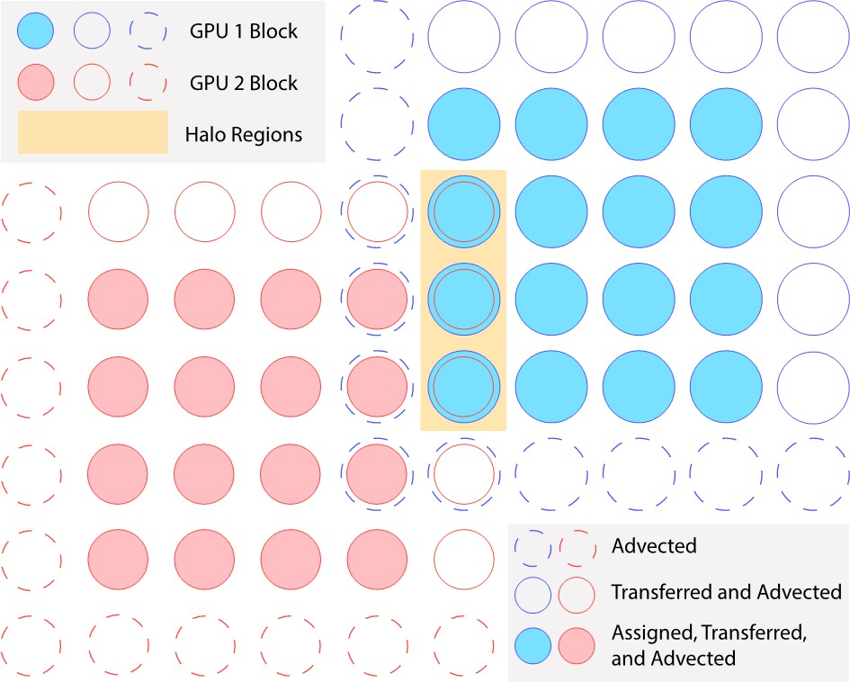
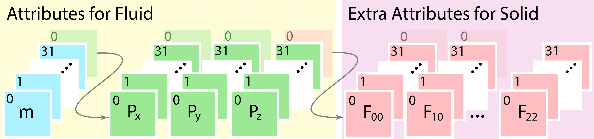

Data Structure
==============
Data structures in a MPM simulation usually need to model the particles, the grids and the mappings between them.
Correspondingly, we encapsulate these in *Partition*, *Particle Buffer* and *Grid Buffer*.

Partition
-----------
**Partition** maintains the active elements, i.e. *block* in this context, and the mapping between block coordinates and linear indices through spatial hashing in the current timestep. 
By *active element*, it means blocks that particles are assgined to, advect to or transfer to as shown below.

It consists of an array to hold all the block coordinates (sparse information), hash tables for spatial hashing and particle buckets for holding particle indices grouped in blocks. 
In multi-GPU cases, it additionally stores halo tags.

Particle Buffer
---------------
**Particle Buffer** consists of particle bins from all the blocks that particles belong to. 
This novel particle data structure is essentially in AoSoA layout similar to `Cabana <https://github.com/ECP-copa/Cabana/wiki/AoSoA>`_.

.. code-block:: cpp

   using f32_ = StructuralEntity<float>;
   using Decorator = decorator<structural_allocation_policy::full_allocation, structural_padding_policy::sum_pow2_align>;
   using ParticleBinDomain = aligned_domain<char, config::g_bin_capacity>;
   using particle_bin4_ = structural<structural_type::dense, Decorator, ParticleBinDomain, attrib_layout::soa, f32_, f32_, f32_, f32_>;

   using ParticleBufferDomain = compact_domain<int, config::g_max_particle_bin>;
   using particle_buffer_ = structural<structural_type::dynamic, Decorator, ParticleBufferDomain, attrib_layout::aos, particle_bin4_>;

The memory layout of each particle bin specified above is SoA with a total number of 4 attributes (arrays) for fluid particles and a length that is a multiple of 32 (warp size) for coalesced access.
Note that the particle buffer is updated in a delayed fashion according to the particle index buckets in the previous substep.
Since the particle buckets are known before *g2p2g*, writing to global memory is generally coalesced.

Grid Buffer
-----------
**Grid Buffer** is composed of grid blocks that are currently visible to particles.

.. code-block:: cpp

   using BlockDomain = compact_domain<char, config::g_blocksize, config::g_blocksize, config::g_blocksize>;
   using grid_block_ = structural<structural_type::dense, Decorator, BlockDomain, attrib_layout::soa, f32_, f32_, f32_, f32_>;

   using GridBufferDomain = compact_domain<int, config::g_max_active_block>;
   using grid_buffer_ = structural<structural_type::dynamic, Decorator, GridBufferDomain, attrib_layout::aos, grid_block_>;

This is the same GPU-tailored SPGrid variant for grid structure used in an earlier `GPU implementation of MPM <https://github.com/kuiwuchn/GPUMPM>`_.

.. note::
    For *particle buffer* and *grid buffer*, we store them in the device-local memory. If replaced with the virtual memory (*unified virtual memory* in CUDA), 
    then the *ParticleBufferDomain* and *GridBufferDomain* could be replaced with *compact_domain<int, config::g_grid_size, config::g_grid_size, config::g_grid_size>* for a more straightforward access through block coordinates.
    However, we encountered unidentified issues utilizing the *unified virtual memory* on Window 10, and the difference between the two resulting performances is trivial.
    Thus we choose the former scheme which is relatively more robust and controllable.