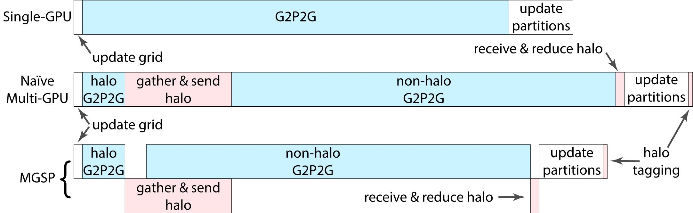

Multi-GPU Design
================

Reduce Memory Overhead
----------------------
To extend from using a single GPU to running on multi-GPUs, we divide the whole simulation domain into partitions (maintained through a list of activated blocks covering
all particles) according to the number of devices and assign one partition to one GPU device. 
An efficient utilization of multi-GPUs for MPM needs to consider the following tasks:

- **Halo Block Tagging**: tag the blocks that overlap partitions on other devices (i.e., the halo blocks).
- **Halo Block Merging**: share block data in the halo region with other devices after executing the G2P2G kernel, for grid reduction and/or particle migration depending on partitioning strategies.

The latency of the memory transfer among GPU devices (required by the above tasks) relies highly on the underneath hardware setup. In most
consumer-level machines, multi-GPU devices are connected via the
slow PCI-Express x16 Gen 3, which may lead to high communication latency. Fortunately, nearly all CUDA devices with compute capability of 1.1 or higher can concurrently perform the memory
copies and computing kernels. 
Therefore, it is viable and critical to hide the latency by overlapping data transfers with computations for a better performance scalability on multi-GPUs.

Partitioning Methods
--------------------
Depending on the dynamics of the simulation, the same partitioning scheme could result in drastically different performances on various scenes. 
Therefore we introduce detailed designs of two MPM-tailored variations of the most widely adopted partitioning methods, 
i.e. the *static geometric (particle) partitioning method* and the *static spatial partitioning method*.
