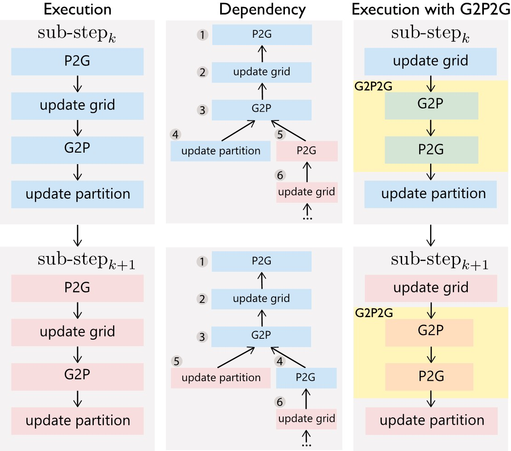

Simulator Pipeline
==================

Our MPM simulator adopts the explicit time-integration scheme. 

The conventional MPM pipeline looks like:

- **Particles-to-Grid (P2G)**. Transfer mass and momentum from particles to grid nodes: :math:`\{m_p, m_p v_p^n\} \rightarrow \{m_i, m_i v_i^n\}`
- **Grid Update**. Update grid velocities with either explicit or implicit time integration: :math:`v_i^{n} \rightarrow v_i^{n+1}`
- **Grid-to-Particles (G2P) and Particle Advection**.  Transfer velocities from grid nodes to particles, evolve particle strains, and project particle deformation gradients for plasticity (if any). Update the particle positions with their new velocities: :math:`\{v_i^{n+1}\} \rightarrow \{v_p^{n+1}, F_p^{n+1}\}`, :math:`\{p_p^{n}, v_p^{n+1}\} \rightarrow \{p_p^{n+1}\}`
- **Partition Update**. Maintain the sparse data structure topology by updating the active-block array and the mapping from block coordinates to array indices. 

We propose a novel pipeline with a fused **G2P2G** kernel as a substitute for the original **P2G** and **G2P**. It allows less memory footprint for each particle (although in total doubled due to double-buffering required by G2P2G) and a better performance in general.

