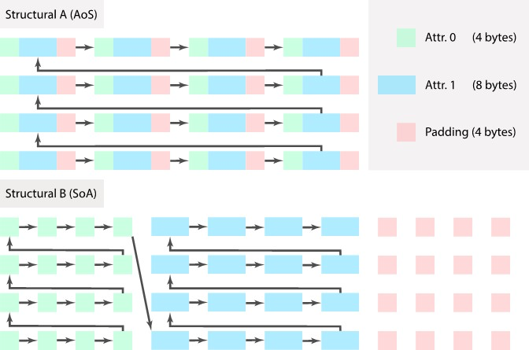

Hierarchy Composition
=====================

Motivation
----------
Following the principle **Data-Oriented Design**, `Yuanming Hu <http://taichi.graphics/>`_ introduces a high-performance programming language, `Taichi <https://github.com/taichi-dev/taichi>`_, wherein dedicated data structures can be developed by assembling components of different properties in static hierarchies.
Taichi provides a powerful and easy-to-use toolchain for developing a wide range of high-performance applications. It implements an abstraction to define multi-level spatial data structures and kernel functions through a user-friendly python front-end and a robust LLVM back-end that automatically handles memory, manages executions, and deploys to CPU or GPU.

Large-scale simulations are spatially sparse in general, which pose great challenges to develop efficient data structures for specific spatial queries. 
In MPM simulations, such queries involves grids in the Eulerian domain and particles in the Lagrangian domain.
We intend to exploit the aforementioned utility from Taichi for designing data structures. Due to the current lack of support of fully using Taichi in a C++ front-end, 
a substitute is provided in native CUDA/C++ environment, which is implemented by C++ template meta-programming. 
Please refer to our `tech doc <https://www.seas.upenn.edu/~cffjiang/research/wang2020multigpu/supp.pdf>`_ or read the following sections for more details.


Components
----------
The entire infrastructure consists of the four major components: *Domain*, *Decorator*, *Structural Node*, and *Structural Instance*. For more details, please refer to *Library/MnBase/Object* in the opensourced code.

Domain
``````````````````````````
**Domain** describes the range for the index of a data structure. It maps from multi-dimensional coordinates to a 1D memory span.

.. code-block:: cpp

    template<typename Tn, Tn Ns...>
    struct domain {
        template<typename... Indices>
        static constexpr Tn offset(Indices&&... indices);
    };

Decorator
``````````````````````````
**Decorator** describes the auxiliary and detailed properties regarding the data structure it decorates.

.. code-block:: cpp

    enum class structural_allocation_policy : std::size_t {
        full_allocation = 0,
        on_demand = 1,
        ...
    };
    enum class structural_padding_policy : std::size_t {
        compact = 0,
        align = 1,
        ...
    };
    enum class attrib_layout : std::size_t {
        aos = 0,
        soa = 1,
        ...
    };
    template <structural_allocation_policy alloc_policy_,
        structural_padding_policy padding_policy_,
        attrib_layout layout_>
    struct decorator {
        static constexpr auto alloc_policy = alloc_policy_;
        static constexpr auto padding_policy = padding_policy_;
        static constexpr auto layout = layout_;
    };

Structural Node
``````````````````````````
**Structural Nodes** with particular properties is formed in a hierarchy to compose a multi-level data structure.
Currently, we support three types of structural nodes (i.e., hash, dense, and dynamic). We are planning to support tree in future releases.

.. code-block:: cpp

    enum class structural_type : std::size_t {
        /// leaf
        sentinel = 0,
        entity = 1,
        /// trunk
        hash = 2,
        dense = 3,
        dynamic = 4,
        ...
    };

No matter what the internal relationship of elements is within a structure (either contiguous- or node-based), 
we assume there is at least one contiguous chunk of physical memory to store the data;
the size is a multiple of the extent of the Domain and the total size of all the attributes of an element (might be padded for alignment).

.. code-block:: cpp

    /// attribute index of a structural node
    using attrib_index = placeholder::placeholder_type;

    /// traits of structural nodes
    template <structural_type NodeType, typename Domain, typename Decoration, typename... Structurals>
    struct structural_traits {
        using attribs = type_seq<Structurals...>;
        using self =
            structural<NodeType, Domain, Decoration, Structurals...>;
        template <attrib_index I>
        using value_type = ...;
        static constexpr auto attrib_count = sizeof...(Structurals);
        static constexpr std::size_t element_size = ...;
        static constexpr std::size_t element_storage_size = ...;
        /// for allocation
        static constexpr std::size_t size = domain::extent * element_storage_size;

        template <attrib_index AttribNo> struct accessor {
            static constexpr uintptr_t element_stride_in_bytes = ...;
            static constexpr uintptr_t attrib_base_offset = ...;
            template <typename... Indices>
            static constexpr uintptr_t coord_offset(Indices &&... is) {
            return attrib_base_offset + Domain::offset(std::forward<Indices>(is)...) * element_stride_in_bytes;
            }
            template <typename Index>
            static constexpr uintptr_t linear_offset(Index &&i) {
            return attrib_base_offset + std::forward<Index>(i) * element_stride_in_bytes;
            }
        };

        // manage memory
        template <typename Allocator> void allocate_handle(Allocator allocator) {
            if (self::size != 0)
            _handle.ptr = allocator.allocate(self::size);
            else
            _handle.ptr = nullptr;
        }
        template <typename Allocator> void deallocate(Allocator allocator) {
            allocator.deallocate(_handle.ptr, self::size);
            _handle.ptr = nullptr;
        }
        // access value
        template <attrib_index ChAttribNo, typename Type = value_type<ChAttribNo>, typename... Indices>
        constexpr auto &val(std::integral_constant<attrib_index, ChAttribNo>, Indices &&... indices) {
            return *reinterpret_cast<Type *>(_handle.ptrval + accessor<ChAttribNo>::coord_offset(std::forward<Indices>(indices)...));
        }
        template <attrib_index ChAttribNo, typename Type = value_type<ChAttribNo>, typename Index>
        constexpr auto &val_1d(std::integral_constant<attrib_index, ChAttribNo>,
                                Index &&index) {
            return *reinterpret_cast<Type *>(
                _handle.ptrval +
                accessor<ChAttribNo>::linear_offset(std::forward<Index>(index)));
        }
        /// data member
        MemResource _handle;
    };
    /// specializations of different types of structural nodes
    template <typename Domain, typename Decoration, typename... Structurals>
    struct structural<structural_type::hash, Domain, Decoration, Structurals...> : structural_traits<structural_type::hash, Domain, Decoration, Structurals...> {...};

We also define two special types of *Structural Nodes*, the root node and the leaf node, to form the hierarchy.

.. code-block:: cpp

    /// special structural node
    template <typename Structural> struct root_instance;
    template <typename T> struct structural_entity;

Structural Instance
``````````````````````````
A variable defined by the above **Structural Node** is an **Structural Instance** spawned given an allocator at the run-time. 
The instance is customizable (e.g. accessing the parent node requires additional data) as it is assembled from selected data components.

.. code-block:: cpp

    enum class structural_component_index : std::size_t {
        default_handle = 0,
        parent_scope_handle = 1,
        ...
    };

    template <typename ParentInstance, attrib_index, structural_component_index>
    struct structural_instance_component;

    /// specializations for each data component
    template <typename ParentInstance, attrib_index>
    struct structural_instance_component<ParentInstance, attrib_index, structural_component_index::parent_scope_handle> {...};

Besides the data components, the **Structural Instance** also inherits from the **Structural Node** that specifies the properties of itself.


.. code-block:: cpp

    /// traits of structural instance, inherit from structural node
    template <typename parent_instance, attrib_index AttribNo>
    struct structural_instance_traits
        : parent_instance::attribs::template type<(std::size_t)AttribNo> {
        using self = typename parent_instance::attribs::type<(std::size_t)AttribNo>;
        using parent_indexer = typename parent_instance::domain::index;
        using self_indexer = typename self::domain::index;
    };

    /// structural instance, inherit from all data components and its traits (which is derived from structural node)
    template <typename ParentInstance, attrib_index AttribNo, typename Components>
    struct structural_instance;
    template <typename ParentInstance, attrib_index AttribNo, std::size_t... Cs>
    struct structural_instance<ParentInstance, AttribNo,
                            std::integer_sequence<std::size_t, Cs...>>
        : structural_instance_traits<ParentInstance, AttribNo>,
        structural_instance_component<ParentInstance, AttribNo, static_cast<structural_component_index>(Cs)>... {
        using traits = structural_instance_traits<ParentInstance, AttribNo>;
        using component_seq = std::integer_sequence<std::size_t, Cs...>;
        using self_instance =
            structural_instance<ParentInstance, AttribNo, component_seq>;
        template <attrib_index ChAttribNo>
        using accessor = typename traits::template accessor<ChAttribNo>;

        // hierarchy traverse
        template <attrib_index ChAttribNo, typename... Indices>
        constexpr auto chfull(std::integral_constant<attrib_index, ChAttribNo>,
                                Indices &&... indices) const {
            ...
        }
        template <attrib_index ChAttribNo, typename... Indices>
        constexpr auto ch(std::integral_constant<attrib_index, ChAttribNo>,
                            Indices &&... indices) const {
            ...
        }
        template <attrib_index ChAttribNo, typename... Indices>
        constexpr auto chptr(std::integral_constant<attrib_index, ChAttribNo>,
                            Indices &&... indices) const {
            ...
        }
    };

Usage
----------
Here, we showcase the usages of the above interface by providing an example of **SPGrid**.

Basic Definitions
``````````````````````````
To simplify the usage, we define certain types and variables that are frequently used.

.. code-block:: cpp

    /// leaf node
    using empty_ = structural_entity<void>;
    using i32_ = structural_entity<int32_t>;
    using f32_ = structural_entity<float>;

    /// attribute index
    namespace placeholder {
        using placeholder_type = unsigned;
        constexpr auto _0 = std::integral_constant<placeholder_type, 0>{};
        constexpr auto _1 = std::integral_constant<placeholder_type, 1>{};
        ...
    }

    /// default data components for constructing instances
    using orphan_signature = std::integer_sequence<std::size_t,  static_cast<std::size_t>(structural_component_index::default_handle)>;

Structural Node Definition
``````````````````````````
The following code defines the **SPGrid** used in our pipeline.

.. code-block:: cpp

    // domain
    using BlockDomain = domain<char, 4, 4, 4>;
    using GridBufferDomain = domain<int, g_max_active_block>;
    // decorator
    using DefaultDecorator = decorator<structural_allocation_policy::full_allocation, structural_padding_policy::compact, attrib_layout::soa>;
    // structural node
    using grid_block_ = structural<structural_type::dense, DefaultDecorator, BlockDomain, f32_, f32_, f32_, f32_>;
    using grid_buffer_ = structural<structural_type::dynamic, DefaultDecorator, GridBufferDomain, grid_block_>;


Create Structural Instance
``````````````````````````
After defining the internal structure, it still requires an allocator and the list of data components to get the instance.

.. code-block:: cpp

    template <typename Structural, typename Signature = orphan_signature>
    using Instance = structural_instance<root_instance<Structural>, (attrib_index)0, Signature>;

    template <typename Structural, typename Componenets, typename Allocator>
    constexpr auto spawn(Allocator allocator) {
        auto ret = Instance<Structural, Componenets>{};
        ret.allocate_handle(allocator);
        return ret;
    }

    auto allocator = ...;
    auto spgrid = spawn<grid_buffer_, orphan_signature>(allocator);

Access Interface
``````````````````````````
Generally, we need to provide both the attribute and child index to access a child of such an instance.

.. code-block:: cpp

    /// acquire blockno-th grid block
    auto grid_block = spgrid.ch(_0, blockno);
    /// access cidib-th cell within this block
    grid_block.val_1d(_0, cidib);   // access 0-th channel (mass)
    /// access cell within by coordinates
    grid_block.val(_1, cx, cy, cz);   // access 1-th channel (velocity x)

Internal Layout
---------------
To gain a better insight into the internal layout, we here give another example.


.. code-block:: cpp

    using Attrib0 = structural_entity<float>;
    using Attrib1 = structural_entity<double>;
    using DecoratorA = decorator<
        structural_allocation_policy::full_allocation, 
        structural_padding_policy::align, 
        attrib_layout:aos>;
    using DecoratorB = decorator<
        structural_allocation_policy::full_allocation, 
        structural_padding_policy::align, 
        attrib_layout:soa>;
    using StructuralA = structural<structural_type::dense, DecoratorA, domain<int, 4, 4>, Attr0, Attr1>;
    using StructuralB = Structural<structural_type::dense, DecoratorB, domain<int, 4, 4>, Attr0, Attr1>;

    :caption: Two *structural nodes* are specified with different *decorators*. The arrows connecting all elements indicate the ascending order in a contiguous chunk of memory. The *structural node* can be used as an attribute of another *structural node* to form a multi-level hierarchy. Elements displayed in the grid view are accessed by an attribute index (marked with different colors) and a coordinate within its domain. Note that the memory size of each *structural* is padded to the next power of 2 due to the alignment decoration.

